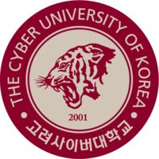

# 👋 Hey!

안녕하세요. 엄다니엘입니다.

### 남들과는 다르게, Diferentemente

남들과 다르게 중학교와 고등학교를 먼저 끝내고 해보고 싶은 것들을 향해 달려가고 있어요. 🏃‍♂️

### 발견의 즐거움, Descoberta

기술보다 새로운 것을 좋아해요! 새로운 것에 도전하는 것만큼 즐거운 것은 없어요. 도전 정신만큼은 저에게 맡기세요. 🎉

### 혼돈에서 찾아온 창조, Criação

새로운 것에 적응하는 것도 좋다면 만드는 것도 좋아해요. 무엇보다 나의 것으로 만드는 것이 제일 중요하다고 생각해요. ✍️

# 🎓 School

### 고려사이버대학교

2학년 | Business Administration

**2019.06 ~ NOW**

# 📚 Stack

제가 자신있는 것들을 모아봤어요.

### Programming Languages

TypeScript, Node.js, Python, Java, C#, PHP

### Backend framework

Express, Koa, Fast API, Flask

### Frontend framework

React.js, Vue.js, MobX, GraphQL

### Server infrastructure

Docker, Kubernetes, VMware ESXi, Citrix XenServer / XCP-ng, Microsoft Hyper-V

### Crawling Framework

Selenium, Pupperteer, Cheerio

### Database solution

Mysql / MariaDB, Prisma 1 & 2, MongoDB, OracleDB, SQLite

# 📞 Contact

제가 더 궁금하시나요? 가볍게 연락주세요. 🤝

📮 Mail [iam@dan.al](mailto:iam@dan.al)

📘 Facebook [danieluhm2004](https://facebook.com/danieluhm2004)

⭐ Instagram [iam_danal](https://www.instagram.com/iam_danal/)

📞 Telegram [danieluhm2004](https://t.me/danieluhm2004)

🕹️ Discord [엄다니엘#0867](https://discordapp.com/users/269459215637020672)
